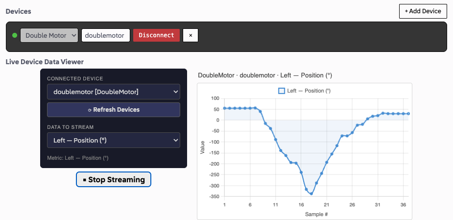
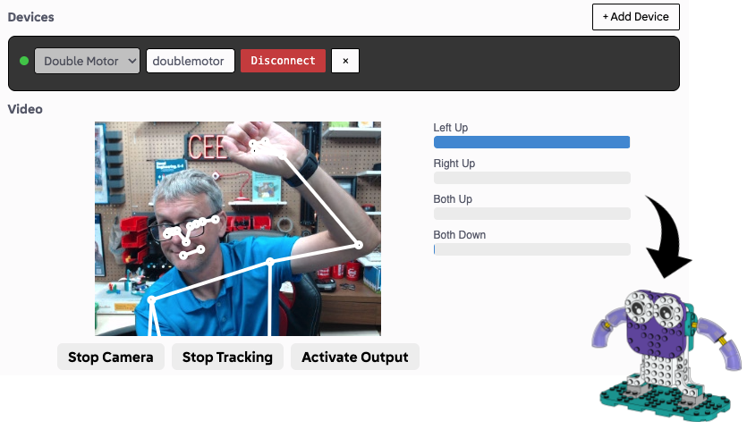
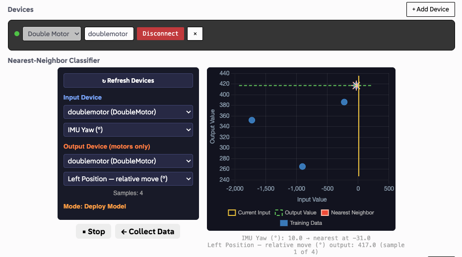
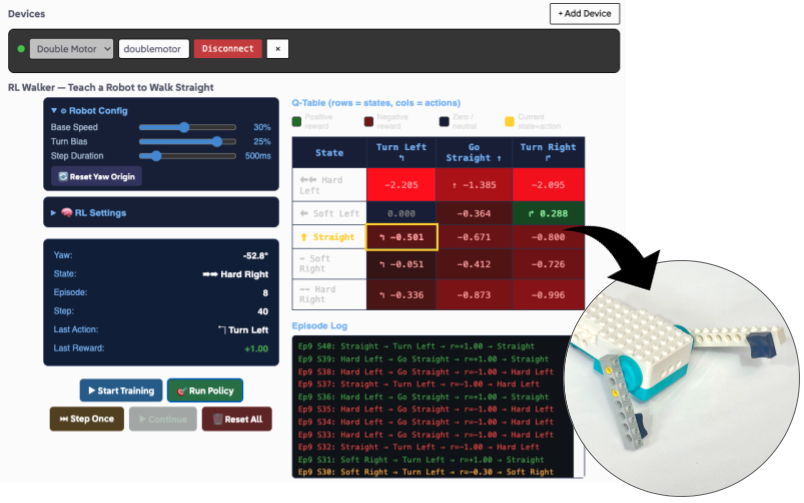
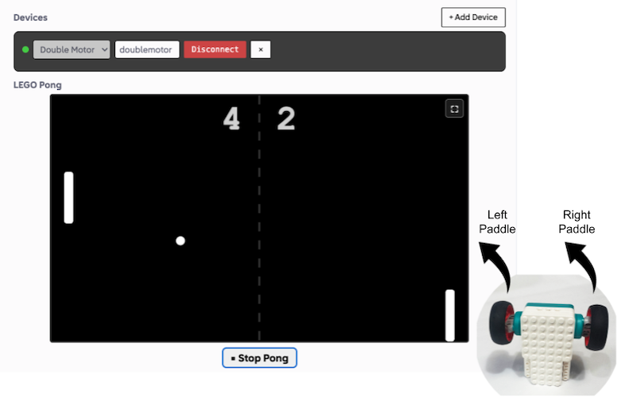
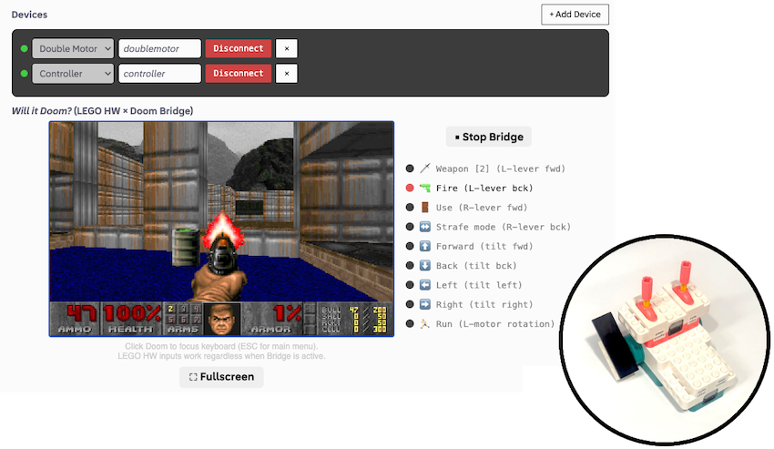
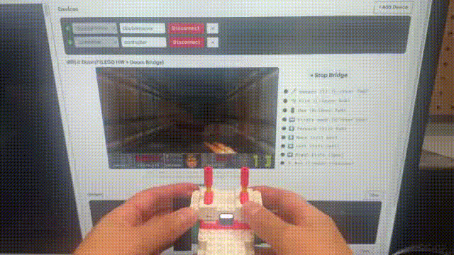

# Beta Python Interface Demos

Demos built on top of the Beta Python Interface (https://beta.python.legoeducation.com)

---

## Running the Demos

1. Download the Python demo file you want to run:
   - [Data Viewer](./plugins/dataviewer.py)
   - [Pose Detection](./plugins/posedetection.py)
   - [Supervised Classification](./plugins/supervisedclassification.py)
   - [Reinforcement Learning](./plugins/reinforcementlearning.py)
   - [Pong](./plugins/pong.py)
   - [Doom](./plugins/doom.py)
2. Navigate to https://beta.python.legoeducation.com
3. "Open" the `.py` file for the demo in the LEGO Education interface
4. Connect your LEGO Education Hardware (and re-name as necessary)
5. Hit "Run" to add the demo to the page
6. Follow instructions/use interface as directed

---

## Description of Demos

### Data Viewer 

The **Data Viewer** allows streaming data from a connected device to be plotted/viewed in real-time on a graph.
Works with any of the LEGO Education Hardware (Single Motor, Double Motor, Color Sensor, Controller).

- File: [`dataviewer.py`](./plugins/dataviewer.py)

### Pose Detection 

The **Pose Detection** connects to the computer's webcam, does
[pose landmark detection](https://developers.google.com/edge/mediapipe/solutions/vision/pose_landmarker),
detects if arms are up-or-down, and controls a Double Motor (suggestion: use the
[Strike a Pose](https://teach.legoeducation.com/en-us/computer-science/lesson/strike-a-pose) model).

- File: [`posedetection.py`](./plugins/posedetection.py)

### Supervised Classification

The **Supervised Classification** links input-values to output-values in a nearest-neighbor supervised
classification model. Collect a series of paired values (inputs and outputs) then deploy the model.
Works with any of the LEGO Education Hardware (Single Motor, Double Motor, Color Sensor, Controller).

- File: [`supervisedclassification.py`](./plugins/supervisedclassification.py)

### Reinforcement Learning

The **Reinforcement Learning** creates a "Smart Walker" from a Double Motor "Silly Walks" robot. With
different legs on each motor, through development of a Reinforcement Learning Q-Table set of values,
the Silly Walks robot learns to walk straight.

- File: [`reinforcementlearning.py`](./plugins/reinforcementlearning.py)

### Pong

The **Pong** game is controlled by the left-and-right sides of the Double Motor. Spinning the motors
move the paddles up and down. Full screen mode takes over the entire browser window.

- File: [`pong.py`](./plugins/pong.py)

### Will it Doom?

*Of course it will!* The **Doom** game is controlled by a Controller and Double Motor. Full screen mode takes over the entire browser window.

**Controller Controls:**
- Left-lever forward: change weapon (cycle through)
- Left-lever back: fire weapon
- Right-lever forward: use/action (e.g. open doors)
- Right-lever back: strafe mode (side-to-side when tilting)

**Double Motor Controls:**
- Tilt forward/back: move forward/back
- Tilt left/right: turn (or strafe) left/right
- Left motor forward: run mode

- File: [`doom.py`](./plugins/doom.py)

---

## Creating new Demos

Interested in creating your own demos? Use GenAI to help you make one!

1. Navigate to the `template` folder: [./template](./template)
2. Download the two files: [`template.py`](./template/template.py) and [`instructions.md`](./template/instructions.md)
3. Feed both files to a LLM, and type in the [`instructions.txt`](./template/instructions.txt) text updating it with new description of desired interface, functionality, behavior, etc.
4. Open the generated Python code in the https://beta.python.legoeducation.com app.
5. Connect your LEGO Education Hardware (and re-name as necessary)
6. Hit "Run" to add the demo to the page
7. Follow instructions/use interface as directed

### Documentation

Visit https://github.com/LEGO/LEGOEducation for the official LEGO Education documentation on coding the hardware with Python.

---

## Cloned Interface

If there is an issue with the official LEGO Education Python Web IDE (https://beta.python.legoeducation.com), use the following.

That is, in case LEGO Education changes the layout of the page, update how the site is deployed, or some other change to the interface
that makes these demonstrations no longer work in their version, you can use the following ***CLONED*** version (last synced, 2026-08-20).

https://edanahy.github.io/pythonbetademos/betasite/

This is a "local" version that runs in GitHub Pages, independent of the LEGO Education domain/server.  It is a snapshot
of the site (aka an unauthorized clone), last synced on 20th of August, 2026.

---

## Credits/Information

Demos created by Ethan Danahy in collaboration with Claude, August 2026.

LEGO, the LEGO logo, the Minifigure, LEGO Education, the LEGO Education logo, DUPLO, the SPIKE logo, MINDSTORMS and the MINDSTORMS logo are trademarks and/or copyrights of the LEGO Group, which does not sponsor, authorize, or endorse this project. All other trademarks and copyrights are the property of their respective owners. All rights reserved.
